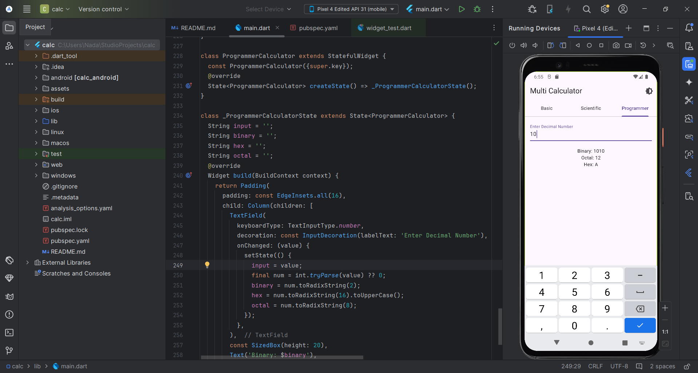

# 🧮 SmartCalc Pro – Multi-Mode Flutter Calculator

## 📖 Overview
**SmartCalc Pro** is a full-featured, modern, and intuitive calculator application built with **Flutter**  
Unlike traditional calculators, SmartCalc Pro offers **three powerful modes** — Basic, Scientific, and Programmer — all integrated into one sleek and user-friendly interface.

The app provides **real-time calculations**, **instant number system conversions**, and **dynamic layouts** that adapt to any screen size — whether mobile, tablet, or desktop.  
It’s ideal for **students**, **engineers**, **programmers**, and **everyday users** who need accurate and efficient calculations.


---

## 🌟 Key Objectives
The main goal of SmartCalc Pro is to **create a unified calculator app** that merges multiple functionalities into a single Flutter project, focusing on:
- Multi-mode functionality within a single interface.
- Clean UI and responsive design using Flutter widgets.
- Efficient and accurate real-time computation.
- Scalability for future updates (like Graph and Unit Conversion modes).

---

## ✨ Features

### 🧠 Basic Mode
- Perform everyday arithmetic operations: addition, subtraction, multiplication, and division.
- Includes percentage and sign toggle options.
- Displays both the expression and the live calculated result.
- Supports continuous operations (chained expressions).

### 🔬 Scientific Mode
- Offers advanced mathematical functions:
  - Trigonometric: sin, cos, tan (and inverses)
  - Logarithmic: log, ln
  - Exponential and power operations
  - Square root and factorial
- Real-time scientific evaluation as you type.
- Smart handling of parentheses and operator precedence.

### 💻 Programmer Mode
- Allows seamless conversion between **Binary**, **Octal**, **Decimal**, and **Hexadecimal** number systems.
- Bitwise operations: AND, OR, XOR, NOT, Shift Left, Shift Right.
- Built-in input validation to ensure correct data entry.
- Great for developers and digital electronics students.
  


---

## 🧩 Technical Overview

### 🏗️ Architecture
The app follows the **MVVM (Model-View-ViewModel)** structure for clarity and scalability:
- **Model:** Handles mathematical logic and calculations.
- **View:** The Flutter UI built using Material Design widgets.
- **ViewModel / Controller:** Connects user input with logical operations in real time.

### ⚙️ State Management
- Built using **setState()** for simplicity.
- Easily upgradable to **Provider** or **Bloc** for large-scale state management.

### 🎨 UI/UX Design
- Built using **Material Design 3** with Flutter.
- **TabBar** navigation to switch between modes.
- **GridView** layout for keypad buttons.
- Smooth transitions and animations between calculator screens.
- Consistent color palette and typography.

---

## 🧱 Folder Structure
lib/
│
├── main.dart # Entry point of the app
├── screens/
│ ├── basic_calculator.dart
│ ├── scientific_calculator.dart
│ └── programmer_calculator.dart
│
├── widgets/
│ ├── keypad_button.dart
│ └── display_screen.dart
│
├── utils/
│ ├── calculator_logic.dart
│ ├── conversion_utils.dart
│ └── constants.dart
│
└── models/
└── history_model.dart


This modular structure keeps the app clean, easy to maintain, and ready for future upgrades.

---

## ⚙️ Getting Started

### 🧰 Prerequisites
Make sure you have installed:
- [Flutter SDK](https://flutter.dev/docs/get-started/install)
- Android Studio / VS Code with Flutter extensions
- Emulator or physical device connected

# 🧠 **How It Works**

### 🔹 **Input Handling**
Each key press (button tap) is processed through the controller that:
- Appends input to the expression string.  
- Validates it to prevent invalid sequences (like multiple operators).  
- Automatically evaluates results for real-time display.  

---

### 🔹 **Expression Evaluation**
Mathematical expressions are computed using Dart’s math library and custom logic:
- Supports **PEMDAS rule** (Parentheses, Exponents, Multiplication/Division, Addition/Subtraction).  
- Handles floating-point precision errors.  
- Provides instant evaluation for smoother UX.  

---

### 🔹 **Programmer Conversions**
- Decimal input is converted instantly to **Binary**, **Octal**, and **Hexadecimal**.  
- Uses custom logic for accurate bitwise transformations.  
- Designed for developers and computer science students.
  


---

# 🖼️ **Screenshots**

| 🧮 **Mode** | 📝 **Description** | 🖼️ **Preview** |
|--------------|--------------------|----------------|
| **Basic** | Simple arithmetic layout |  |
| **Scientific** | Advanced functions for students |  |
| **Programmer** | Binary, Hex, and Bitwise operations |  |

---

# 🎯 **Future Enhancements**

- 🧮 **Add Graphing Mode** — for function visualization.  
- 🧭 **Add Unit Conversion Mode** — length, weight, temperature, etc.  
- 📊 **Add History Panel** — to review previous calculations.  
- 🌐 **Add Localization** — for multi-language support.  
- 💾 **Add Saved Results & Settings** — using SharedPreferences.  

---

# 🤝 **Contribution Guide**
--
Contributions are **welcome and appreciated!**

1. **Fork** the repository  
2. **Create a new branch**  
   ```bash
   git checkout -b feature-name
Make your edits and commit

bash
Copy code
git commit -m "Added new feature"
Push your branch and submit a Pull Request

✅ Make sure your code follows Flutter best practices and includes clear documentation.

##🧰 Tools & Technologies
--
  -Flutter 3.x  
  -Dart
  -Material Design 3
  -math.dart (for calculations)
  -Custom Widgets & Logic Files

##🪪 License
--
This project is licensed under the MIT License.
You’re free to use, modify, and distribute it with proper attribution.

## 🧑‍💻 Author

- **Farida Ayman** → [GitHub Profile](https://github.com/FaridaAyman)  
- **Nada Attia** → [GitHub Profile](https://github.com/NadaAttia04)  
- **Rodina Ahmed** → [GitHub Profile](https://github.com/RodinaAhmed)

---
⭐ If you like this project, don’t forget to star the repository.
